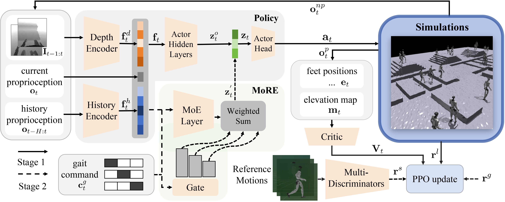
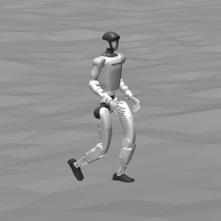
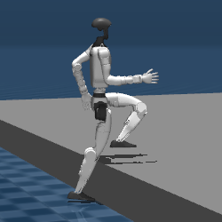
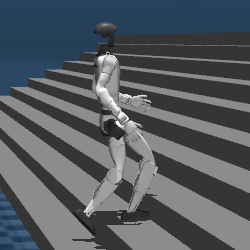
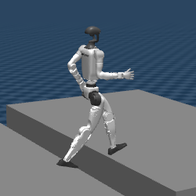

<br>
<p align="center">
<h1 align="center"><strong>MoRE: Humanoid Lifelike Gaits Learning on Complex Terrains</strong></h1>
</p>

<div id="top" align="center">

[](https://arxiv.org/abs/2506.08840)
[](https://more-humanoid.github.io/)

</div>


<p>This is the official PyTorch implementation of the paper 
<a href="https://arxiv.org/abs/2506.08840">"MoRE: Mixture of Residual Experts for Humanoid Lifelike Gaits Learning on Complex Terrains"</a>.
</p>

<p class="center">
  
</p>

## 🛠️ Setup Environment

Clone this repository:
```bash
git clone https://github.com/TeleHuman/MoRE.git
cd MoRE
```
Create a conda environment:
```bash
conda env create -f conda_env.yml 
conda activate more
```
Install pytorch 2.3.1 with cuda-12.1:
```bash
conda install pytorch==2.3.1 torchvision==0.18.1 torchaudio==2.3.1 pytorch-cuda=12.1 -c pytorch -c nvidia
```

Download and install [Isaac Gym](https://developer.nvidia.com/isaac-gym):
```bash
cd isaacgym/python && pip install -e .
```
Install rsl_rl and legged gym:
```bash
cd rsl_rl && pip install -e . && cd .. 
pip install -e .
```

## 🚀 Getting Started

1️⃣ **Train base loco policy**: \
This stage trains a fundamental locomotion policy, which will later used in the residual learning phase.
```bash
python legged_gym/scripts/train.py --task g1_16dof_loco --headless
```
* Train for 30k–50k iterations (recommended: ≥40k).
* Use at least 3000 environments for stable learning.

2️⃣ **Train residual policy**: \
In this stage, the model learns a residual policy built upon the pre-trained base policy.

Before training, set the checkpoint path of the base policy in `g1_16dof_moe_residual_config.py`
```
loco_expert_ckpt_path = "./logs/g1_16dof_loco/xxxxx/model_xxx.pt"
```
Then, start training:
```bash
python legged_gym/scripts/train.py --task g1_16dof_resi_moe --headless
```
* The body mask dataset required for training canbe downloaded from [📎 This link](https://1drv.ms/u/c/ec72522c19d152ff/EQTi52kL1hNOg43MWMr_1qkBoimXUGg-4a1-HY-f0YIYIw?e=TR5uBE). Place it under `./body_mask_data` before running trianing.
* Train for 40k iterations in total. (First 30k iterations: train the residual network. Last 10k iterations: enable body mask for deployment adaptation.）
* Use at least 6000 environments for optimal results.

The second training stage supports distributed multi-GPU training for faster convergence.
```bash
torchrun --nproc_per_node=2 legged_gym/scripts/train.py --task=g1_16dof_resi_moe --headless
```

3️⃣ **Visualize**: \
After training, you can visualize the learned policy using the following command:
```bash
python legged_gym/scripts/play.py --task g1_16dof_loco/g1_16dof_resi_moe --load_run ${policy_path}
```
 🕹️ Viewer Controls \
You can manually control the robot behaviors during visualization.

| Key | Function |
|:----:|:----------|
| `W, A, S, D` | Move forward, left, backward, right |
| `Z, X, C` | Switch gait command — `Z`: walk/run, `X`: high-knees, `C`: squat |
| `[ , ]` | Switch between robots |
| `Space` | Pause / Unpause simulation |

4️⃣ **Validate in Mujoco**: \
We provide four types of terrain environments for Mujoco validation: 

<table>
  <tr>
    <th>Roughness</th>
    <th>Pit</th>
    <th>Stairs</th>
    <th>Gap</th>
  </tr>
  <tr>
    <td></td>
    <td></td>
    <td></td>
    <td></td>
  </tr>
</table>


The specific terrain to evaluate can be selected by configuring the YAML file (`g1_16dof_resi_moe.yaml`).

Run the following command for Mujoco validation:
```bash
python deploy/deploy_mujoco/deploy_mujoco_with_resi.py g1_16dof_resi_moe.yaml
```


## 📄 License

This codebase is under [CC BY-NC 4.0 license](https://creativecommons.org/licenses/by-nc/4.0/deed.en). You may not use the material for commercial purposes, e.g., to make demos to advertise your commercial products.

## Acknowledgements
We thank [@lsx162534](https://github.com/lsx162534) and [@ChenN-Scott](https://github.com/ChenN-Scott) for their help with the code implementation.

## 📝 Citation

If you find our work useful, please consider citing:
```
@misc{wang2025moremixtureresidualexperts,
      title={MoRE: Mixture of Residual Experts for Humanoid Lifelike Gaits Learning on Complex Terrains}, 
      author={Dewei Wang and Xinmiao Wang and Xinzhe Liu and Jiyuan Shi and Yingnan Zhao and Chenjia Bai and Xuelong Li},
      year={2025},
      eprint={2506.08840},
      archivePrefix={arXiv},
      primaryClass={cs.RO},
      url={https://arxiv.org/abs/2506.08840}, 
}
```