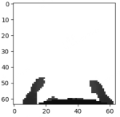

# Body Mask Data

This folder contains the Body Mask Data used during the residual policy training stage.

In simulation, we employ a Warp-based depth camera to accelerate rendering. However, this renderer only includes the static terrain mesh and does not capture the robot’s own body mesh, resulting in depth images without self-occlusion.
To deploy the policy in real-world, we collected body self-occlusion masks during motion, and add them to the warp camera rendered depth during the second training stage.

## 🧠 Overview

We provide the body mask data used during training, which were collected in simulation for the three locomotion behaviors:

* Walk & Run
* High-Knees
* Squat

The body mask dataset can be downloaded from: [📎 This link](https://1drv.ms/u/c/ec72522c19d152ff/EQTi52kL1hNOg43MWMr_1qkBoimXUGg-4a1-HY-f0YIYIw?e=TR5uBE).

## 🧩 Data Description

The provided **body mask dataset** is stored in a single `.npz` file, which can be loaded directly using NumPy:

```python
import numpy as np
data = np.load('./file_name.npz', allow_pickle=True)
```

The `.npz` file contains two keys:

| Key | Shape | Description |
|-----|--------|-------------|
| `body_masks` | `(batch, 64, 64)` | Depth images with body-mask encoding. Each element is a normalized depth value in the range **[-0.5, 0.5]**, while **non-body-mask regions are filled with 1.0**. |
| `gait` | `(batch,)` | Integer gait indices corresponding to each sample (e.g., walk, run, high-knees, squat). |

Example Visualization

>   
> Example body mask sample (white regions are filled with **1**, representing non-body areas; dark regions denote normalized depth value).

## 🧰 Collecting New Body Masks

If you wish to collect body mask data for other locomotion behaviors or robot configurations, you can generate them directly from the simulation:


To record new body mask data, you need to manually add corresponding saving logic in  
`legged_gym/envs/base/legged_robot.py`.

Body masks can be collected when running `play.py` by setting:
```bash
use_camera=True
warp_camera=True
```
The camera captures a depth image including the robot’s own mesh, which is stored in the `depth_buffer` in class `LeggedRobot`.

Stored the collected data as a `.npz` file using code similar to:
```python
numpy.savez(save_path,
            body_masks=body_masks_list,
            gait=gait_list)
```
